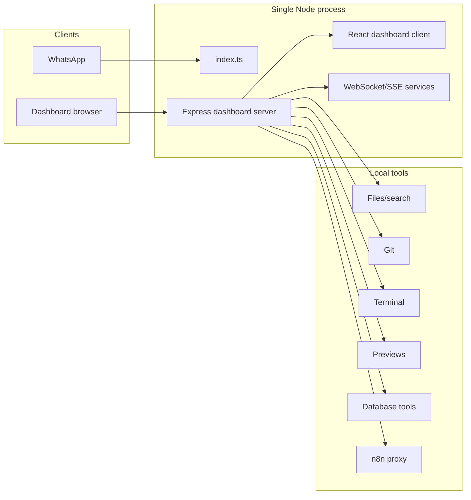
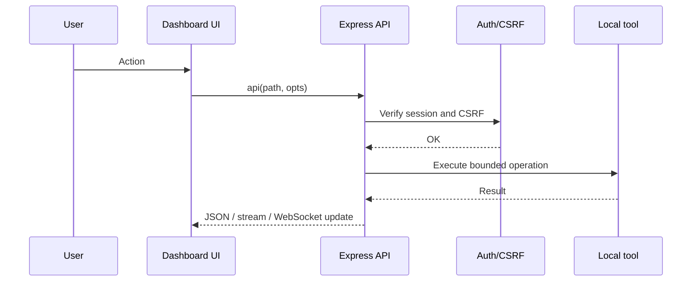
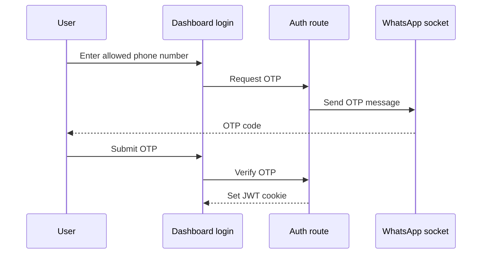

# Architecture Diagrams

For narrative context see [Project_Architecture_Blueprint.md](./Project_Architecture_Blueprint.md).

## System Context

```mermaid
flowchart LR
  subgraph clients [Clients]
    WA[WhatsApp]
    WEB[Dashboard browser]
  end

  subgraph process [Single Node process]
    IDX[index.ts]
    SRV[Express dashboard server]
    REACT[React dashboard client]
    WS[WebSocket/SSE services]
  end

  subgraph tools [Local tools]
    FILES[Files/search]
    GIT[Git]
    TERM[Terminal]
    PREVIEW[Previews]
    DB[Database tools]
    N8N[n8n proxy]
  end

  WA --> IDX
  WEB --> SRV
  SRV --> REACT
  SRV --> WS
  SRV --> FILES
  SRV --> GIT
  SRV --> TERM
  SRV --> PREVIEW
  SRV --> DB
  SRV --> N8N
```

## Dashboard Request Flow

```mermaid
sequenceDiagram
  participant U as User
  participant UI as Dashboard UI
  participant API as Express API
  participant Auth as Auth/CSRF
  participant Tool as Local tool

  U->>UI: Action
  UI->>API: api(path, opts)
  API->>Auth: Verify session and CSRF
  Auth-->>API: OK
  API->>Tool: Execute bounded operation
  Tool-->>API: Result
  API-->>UI: JSON / stream / WebSocket update
```

## WhatsApp OTP Flow

```mermaid
sequenceDiagram
  participant U as User
  participant UI as Dashboard login
  participant API as Auth route
  participant WA as WhatsApp socket

  U->>UI: Enter allowed phone number
  UI->>API: Request OTP
  API->>WA: Send OTP message
  WA-->>U: OTP code
  U->>UI: Submit OTP
  UI->>API: Verify OTP
  API-->>UI: Set JWT cookie
```
